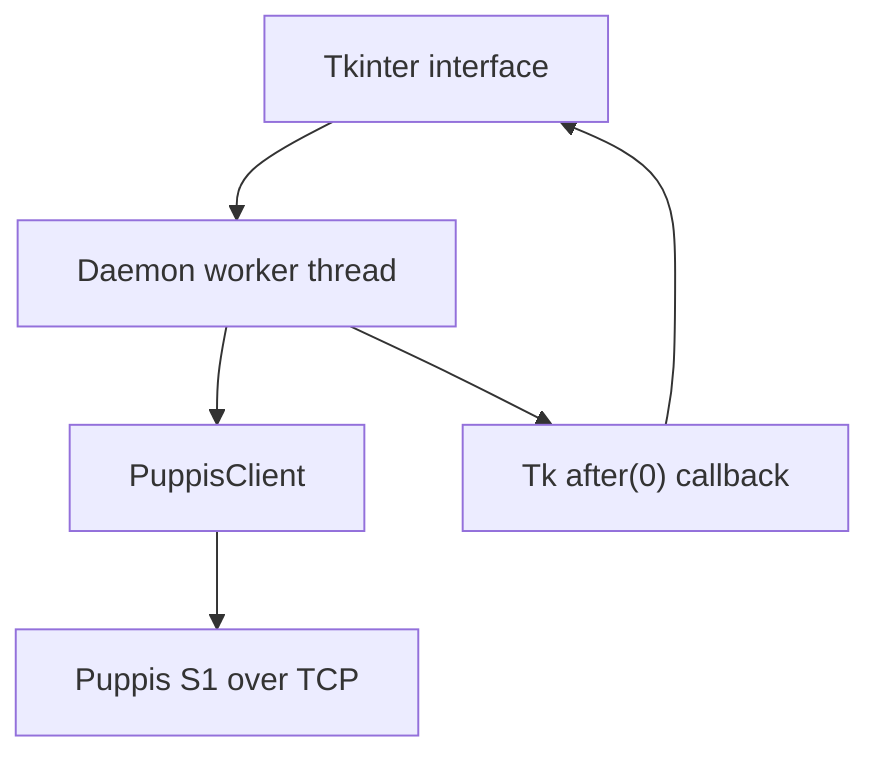
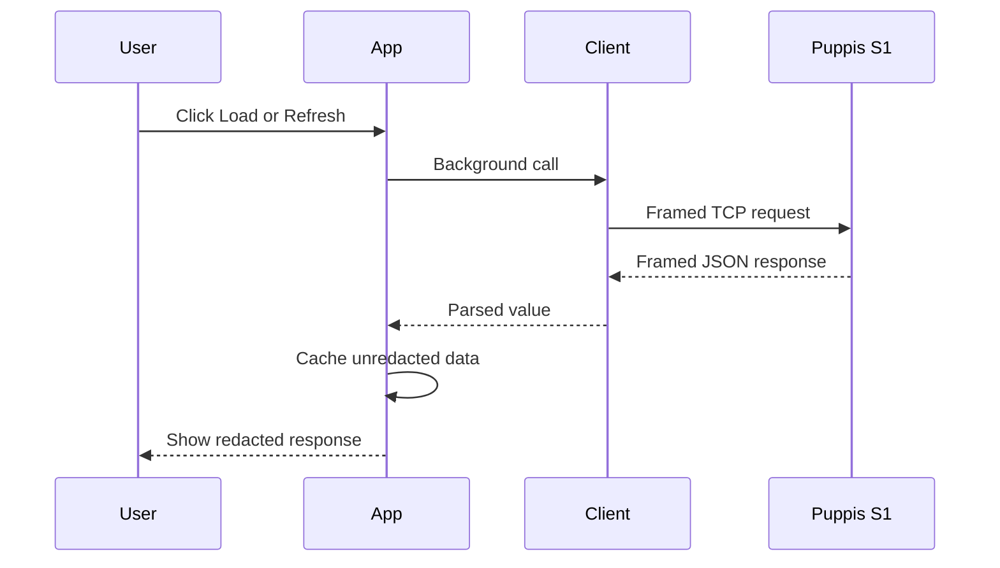
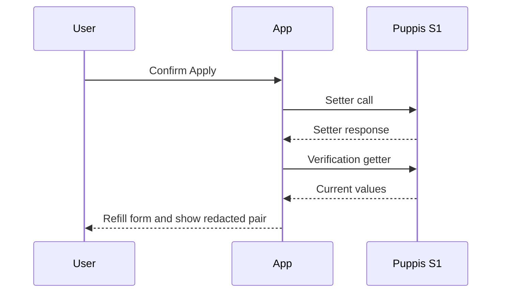

# Puppis S1 Config Tool

## Complete User and Technical Guide

This document describes the supplied single-file Python program, **Puppis S1 Config Tool**. It covers what the program does, how to run it safely, how every visible feature behaves, the TCP packet format, the internal architecture, error handling, security properties, and the important limitations of the current implementation.

The guide is based on the supplied source snapshot. That source does not contain an application version number or a firmware compatibility matrix, so compatibility outside the protocol and device defaults stated in the code is not guaranteed.

> [!WARNING]
> This tool writes directly to a PrismXR Puppis S1 over an undocumented or reverse-engineered local configuration protocol. Wi-Fi and DHCP changes can immediately disconnect the computer, move the device to another network, or make the device unreachable. The raw `setFactory`, `setMode`, `setCountryCode`, `setBoost`, and `setLed` calls have no argument validation. Do not send a setter unless you know the exact argument schema expected by your firmware.

## 1. What the program is

Puppis S1 Config Tool is a desktop GUI written with Python's Tkinter toolkit. It communicates directly with a Puppis S1 using a TCP socket rather than controlling the official PrismXR desktop application.

Its default connection is:

| Setting | Default |
| --- | --- |
| Device address | `192.168.137.254` |
| TCP port | `10081` |
| Local/source bind address | Automatic; the field is blank |
| Socket timeout | `5.0` seconds |
| Request message type | `0x01` |

The program has no third-party Python dependencies. It uses only standard-library modules: `json`, `socket`, `threading`, `time`, `traceback`, `zlib`, `pathlib`, and `tkinter`. Tkinter belongs to the standard library but is an optional OS package in some Linux distributions.

The program is not:

- a command-line utility;
- a background service;
- a firmware updater;
- a full backup-and-restore system;
- a network scanner or automatic device-discovery tool;
- an authenticated or encrypted management client; or
- a replacement implementation of every feature in the official app.

## 2. Implemented feature summary

| Feature | Implemented behavior | Important boundary |
| --- | --- | --- |
| Connection test | Calls `getDevice` and displays a redacted response | Does not populate the backup cache |
| Full refresh | Calls 12 known getters sequentially and shows their responses | Each getter opens a new TCP connection |
| Network refresh | Calls six network-related getters | Read-only, except for the separate DHCP editor |
| 5G hotspot editor | Loads and writes eight known 5G fields | `5G` is the protocol's label; it is not mobile/cellular 5G |
| 2G hotspot editor | Loads and writes eight known 2G fields | Values are sent as strings and are not validated |
| DHCP editor | Loads and writes seven DHCP fields | Invalid values can make the device unreachable |
| Raw API console | Sends any entered function name and JSON argument value | Setters can be destructive; schemas are not documented in the source |
| Redacted JSON export | Saves cached getter data with selected secret keys replaced | It is reference data only; there is no import or restore function |
| Background networking | Keeps the Tkinter window responsive during socket work | Multiple operations can still be launched concurrently |
| Status and log | Shows operation state, timestamps, errors, and tracebacks | Log entries exist only in memory and are not automatically saved |

## 3. Requirements

### 3.1 Hardware and network

You need:

1. A PrismXR Puppis S1 reachable from the computer.
2. A working IPv4 route from the computer to the device address.
3. Permission for the Python process to make an outbound TCP connection to port `10081`.
4. The official PrismXR Desktop application closed while this program is using the device.

The source explicitly warns that PrismXR Desktop can conflict with the connection. If a complete response header is not received, the program's error message specifically recommends closing PrismXR Desktop.

### 3.2 Python and Tkinter

Use Python 3. The source is a Python 3 script and begins with a `python3` shebang. A current Python 3 release is the safest choice.

Check Python:

```bash
python3 --version
```

On Windows, the Python launcher may be used instead:

```powershell
py -3 --version
```

Check Tkinter without starting the Puppis tool:

```bash
python3 -m tkinter
```

Or on Windows:

```powershell
py -3 -m tkinter
```

If that test fails on Linux, install the Tk/Tkinter package supplied by the distribution, then repeat the test. A normal installation from the official Windows Python installer usually includes Tcl/Tk. Python installations from other distributors may package it separately.

### 3.3 Save the source as a Python file

The supplied attachment is text, but its contents are executable Python. Save or rename it to a `.py` filename, for example:

```text
puppis_s1_config_tool.py
```

The filename does not otherwise matter.

## 4. Starting the program

From the directory containing the script:

### Windows

```powershell
py -3 .\puppis_s1_config_tool.py
```

### Linux or macOS

```bash
python3 ./puppis_s1_config_tool.py
```

On Unix-like systems, the shebang also permits direct execution after marking the file executable:

```bash
chmod +x ./puppis_s1_config_tool.py
./puppis_s1_config_tool.py
```

The main window opens at `1060 × 760` pixels and cannot be resized below `900 × 620` pixels. Closing the window ends the application. Network workers are daemon threads, so an in-progress request is not guaranteed to finish if the window is closed.

## 5. Recommended first-use procedure

Use this order to minimize the chance of accidentally overwriting a value or losing connectivity:

1. Connect the computer to the network/interface that can reach the Puppis S1.
2. Close PrismXR Desktop completely.
3. Start the tool.
4. Leave **Local bind IP** blank initially.
5. Keep the default address and port unless the device is known to use different ones.
6. Click **Test**.
7. If the device responds, click **Refresh All**.
8. Click **Export Redacted Backup** and keep the JSON as a human-readable reference.
9. Before editing Wi-Fi, click **Load Wi-Fi** or the relevant **Load 5G**/**Load 2G** button.
10. Change only the field you understand, preserve the loaded values in every other visible field, and apply one band at a time.
11. Treat DHCP and raw setters as advanced operations.

> [!IMPORTANT]
> The exported JSON is not a restorable configuration backup. Password-like fields are deliberately removed, no import feature exists, and the export can omit data that was never loaded into the in-memory cache.

## 6. Interface reference

The interface contains a connection bar, five tabs, and a status line.

### 6.1 Connection bar

#### Device IP

The IPv4 address or hostname passed to `socket.connect()`. Its default is `192.168.137.254`.

The program does not validate this value before using it. Resolution and connection errors are reported by the operating system through the background-operation error dialog and Log tab.

#### Port

The TCP destination port, default `10081`. The text is converted with `int()` each time a client is created. Non-numeric text causes the operation to fail. There is no explicit range check; the socket layer rejects invalid port numbers.

#### Local bind IP

An optional local/source IPv4 address. When non-empty, the program calls:

```python
sock.bind((local_ip, 0))
```

The `0` asks the operating system to select an ephemeral local source port. The field does **not** assign an address to an interface, create a route, or change the computer's network settings. The computer must already own the entered IP address.

The built-in tooltip suggests `192.168.137.100` only when automatic routing fails. Do not enter it unless that address is actually configured on a local interface; otherwise the bind will fail.

#### Timeout

The socket timeout in seconds, default `5.0`. The text is converted with `float()`. The timeout applies to blocking socket work such as connection and receive operations. Increasing it can help with a slow device, but it does not repair an invalid route or a conflicting client.

#### Test

Calls `getDevice` once.

- The response is stored in `raw_last_response`.
- A recursively redacted copy is placed in the Overview tab.
- A response whose top-level `status` equals `"ok"` produces a success dialog.
- Any other top-level status produces a warning dialog.

Test does not add the result to `last_data`, so using Test alone does not provide data for the redacted export.

#### Refresh All

Calls all entries in `TESTED_GETTERS`, in this order:

1. `getNetRf`
2. `getDevice`
3. `getCountryCode`
4. `getChInfo`
5. `getLanIPInfo`
6. `getDhcpInfo`
7. `getProductInfo`
8. `getUpgrade`
9. `getNetIPInfo`
10. `getNetPtInfo`
11. `get5GHotspot`
12. `get2GHotspot`

Every call uses a fresh TCP connection. A failure in one getter is caught and stored under that getter as:

```json
{
  "error": "error message"
}
```

The remaining getters are still attempted. On completion:

- the results are merged into `last_data`;
- a redacted copy is displayed in Overview; and
- available hotspot and DHCP fields are copied into their editors.

#### Load Wi-Fi

Calls `get5GHotspot`, then `get2GHotspot`, and fills both hotspot editors. Unlike Refresh All, its two calls are not individually protected: if either call raises an exception, the whole Load Wi-Fi task is reported as failed.

The redacted result is also displayed in the Raw API response box.

#### Export Redacted Backup

Writes the current `last_data` cache to a user-selected JSON file. See [Redacted backup behavior](#11-redacted-backup-behavior) for the exact schema and limitations.

### 6.2 Overview tab

Overview is a scrollable text area used by Test and Refresh All.

- Test replaces it with the redacted `getDevice` response.
- Refresh All replaces it with the redacted collection of all tested getter results.
- It is a normal editable Tkinter text widget, but editing the displayed text does not alter the device or `last_data`.

### 6.3 Wi-Fi tab

The Wi-Fi tab has separate **5G Hotspot** and **2G Hotspot** panels. The names are copied from the device API functions `get5GHotspot` and `get2GHotspot`; they describe the device's Wi-Fi configurations, not cellular service.

Each panel contains the same fields:

| UI label | API key | Current program behavior |
| --- | --- | --- |
| SSID | `ssid` | Required by the high-level Apply action |
| Password | `pwd` | Hidden with `*` unless Show password is enabled |
| pt | `pt` | Passed through without interpretation |
| Channel | `ch` | Passed as a string; no channel/range validation |
| Encrypt | `encrypt` | Passed through without enum validation |
| Enabled/en | `en` | Passed as a string; no Boolean conversion |
| Country code | `code` | Passed through without regulatory validation |
| Bandwidth | `bw` | Passed as a string; no supported-width validation |

The meanings and allowed values for `pt`, `encrypt`, `en`, `code`, and `bw` are not defined in the source. The safest procedure is to load the current configuration and retain the exact current representation for every field you are not intentionally changing.

#### Show password

Toggles only the visual masking of the password entry. The actual password remains in the Tkinter `StringVar` and the in-memory response cache. The checkbox does not change what is sent to the device.

#### Load 5G / Load 2G

Calls the corresponding getter, stores the response in `last_data`, fills any recognized fields found under the response's top-level `data` object, and shows a redacted response in the Raw API response box.

Fields absent from `data` are left unchanged in the UI. A malformed response or a response without a `data` key is displayed but does not update the form.

#### Apply 5G / Apply 2G

The Apply sequence is:

1. Read the eight visible fields.
2. Omit every field whose entry is the empty string.
3. Reject the operation if the resulting `ssid` is missing or empty.
4. If `pwd` is missing or empty, ask whether to continue.
5. Ask for confirmation because clients may disconnect.
6. Call the corresponding setter with the constructed argument object.
7. Call the corresponding getter as a verification read.
8. Update the editor from the getter response and show the redacted setter/getter pair.
9. Report success only when the setter response has top-level `status: "ok"`; otherwise show a warning containing that status.

For 5G, the functions are `set5GHotspot` and `get5GHotspot`. For 2G, they are `set2GHotspot` and `get2GHotspot`.

> [!CAUTION]
> The note displayed in the Wi-Fi tab says the tool loads the full current hotspot object, modifies it, and sends the full object back. The current code does **not** do that automatically. Apply sends only the non-empty values from the eight visible fields. It does not fetch immediately before the write, merge unknown response fields, or preserve fields the firmware may return outside those eight keys.

There is another subtle consequence: clearing Password and confirming does not explicitly send `"pwd": ""`; the program omits `pwd` from the arguments. The same is true for every empty optional field. Whether omission preserves, clears, defaults, or invalidates a setting depends on the device firmware. This UI therefore cannot reliably request an intentional empty value.

The verification getter can also make a successful write look like a failure. If the setter changes the network quickly enough that the following getter cannot reconnect, the background task reports failure even though the setter may already have taken effect.

### 6.4 Network tab

The left side contains read-only-by-convention network information; the right side contains the DHCP editor.

#### LAN / Device Network Info

**Refresh Network Info** calls these getters sequentially:

- `getLanIPInfo`
- `getDhcpInfo`
- `getNetIPInfo`
- `getNetPtInfo`
- `getChInfo`
- `getNetRf`

Individual failures are caught and embedded in the displayed result, so one failed getter does not stop the rest. Results are merged into `last_data`. The DHCP form is filled from `getDhcpInfo` when its response contains a top-level `data` object.

The text area is editable, but edits affect neither cached data nor the device.

#### DHCP fields

| UI label | API key | Validation in the current code |
| --- | --- | --- |
| Start IP | `startIp` | Required, non-empty only |
| End IP | `endIp` | Required, non-empty only |
| Gateway IP | `gIp` | Required, non-empty only |
| DNS 1 | `dns1` | Required, non-empty only |
| DNS 2 | `dns2` | Required, non-empty only |
| Lease minutes | `lease` | Required, non-empty only |
| Mode | `mode` | Required, non-empty only |

All values are sent as JSON strings. The code does not validate:

- IPv4 syntax;
- whether the start and end addresses are ordered;
- whether the addresses and gateway share an appropriate subnet;
- duplicate addresses;
- reserved/network/broadcast addresses;
- DNS reachability;
- whether Lease is numeric or within a safe range; or
- whether Mode is a supported firmware value.

#### Load DHCP

Calls `getDhcpInfo`, caches the response, fills recognized fields from `data`, and displays the redacted response in the Raw API response box.

#### Apply DHCP

The program requires all seven fields to be non-empty, asks for confirmation, calls `setDhcpInfo`, and immediately calls `getDhcpInfo` to verify/read back the setting. The pair of responses is displayed in the Raw API response box, and the verification response refills the form.

There is no explicit comparison between requested and returned values and no success dialog. A completed task means both calls returned without a Python exception; it does not prove that the device accepted every value.

As with hotspot writes, a DHCP change can break the route before the verification getter runs. In that case, the operation can be reported as failed after the setting was already applied.

### 6.5 Raw API tab

The Raw API tab is an advanced protocol console.

#### Function

The function control is an editable combo box. It suggests every entry in `RAW_FUNCTIONS`, but it also accepts a custom function name.

#### Args JSON

The contents are parsed with `json.loads()` and inserted as the value of the request's `args` property. The default is `{}`.

Although the parser accepts any valid JSON value—including an array, string, number, Boolean, or `null`—known requests use an object. Use `{}` for getters unless a confirmed device schema requires something else.

Examples:

```json
{}
```

```json
{
  "ssid": "Example network",
  "pwd": "example password"
}
```

The second example only demonstrates JSON syntax. It is not a complete or firmware-verified hotspot setter payload.

#### Send Raw Call

The program:

1. rejects an empty function name;
2. rejects invalid JSON locally;
3. asks for confirmation when the function name starts with the exact lowercase text `set`;
4. sends one request; and
5. displays a redacted response.

The name-based safety check is limited. A mutating command whose name does not begin with lowercase `set` receives no warning. Conversely, any harmless custom function beginning with `set` does receive the warning.

Raw calls do not update `last_data`, so they are not included in Export Redacted Backup. Their most recent unredacted response is retained in `raw_last_response` until replaced or the process exits.

#### Use selected getter args `{}`

Replaces the entire argument editor with an empty JSON object. Despite the label, the button does not verify that the selected function is a getter.

#### Response

Displays `pretty(redact(response))`. The display is editable, but edits do not affect the retained raw response or device state.

### 6.6 Log tab and status line

Every background task updates the status line and appends a timestamped message to Log.

Typical lifecycle:

```text
[12:00:00] Testing connection...
[12:00:01] Testing connection: done
```

On failure, the status and log contain the exception message, and the full Python traceback is appended to the Log tab. Unless an operation supplied a custom failure callback—which the current operations do not—a modal error dialog is also shown.

The log is not written to disk and has no export or clear button. It may disclose local paths, addresses, and exception details, so inspect it before sharing screenshots.

## 7. Known API function catalog

The function names below are present in the source. The descriptions state the apparent purpose inferred from the name and where the function is used; the source does not define the firmware's complete request or response schemas.

### 7.1 Getters exercised by Refresh All

| Function | Apparent purpose | High-level use |
| --- | --- | --- |
| `getNetRf` | Radio/network RF information | Refresh All, Refresh Network, Raw API |
| `getDevice` | Device identity or general device state | Test, Refresh All, Raw API |
| `getCountryCode` | Current regulatory/country code | Refresh All, Raw API |
| `getChInfo` | Channel information | Refresh All, Refresh Network, Raw API |
| `getLanIPInfo` | LAN address information | Refresh All, Refresh Network, Raw API |
| `getDhcpInfo` | DHCP configuration | Refresh All, Network editor, Raw API |
| `getProductInfo` | Product metadata | Refresh All, Raw API |
| `getUpgrade` | Upgrade-related state or metadata | Refresh All, Raw API; no upgrade action exists |
| `getNetIPInfo` | Network IP information | Refresh All, Refresh Network, Raw API |
| `getNetPtInfo` | Protocol-specific network `pt` information | Refresh All, Refresh Network, Raw API |
| `get5GHotspot` | 5G-labeled hotspot configuration | Refresh All, Wi-Fi editor, Raw API |
| `get2GHotspot` | 2G-labeled hotspot configuration | Refresh All, Wi-Fi editor, Raw API |

### 7.2 Setters exposed in Raw API

| Function | High-level support | Risk/status in this source |
| --- | --- | --- |
| `set5GHotspot` | Wi-Fi editor | Implemented with limited validation; raw use also allowed |
| `set2GHotspot` | Wi-Fi editor | Implemented with limited validation; raw use also allowed |
| `setCountryCode` | None | Raw only; arguments not documented or validated |
| `setDhcpInfo` | DHCP editor | Implemented with completeness checks only; raw use also allowed |
| `setMode` | None | Raw only; arguments not documented or validated |
| `setBoost` | None | Raw only; arguments not documented or validated |
| `setLed` | None | Raw only; arguments not documented or validated |
| `setFactory` | None | Raw only; potentially factory-reset related and especially destructive |

The source comment says the official app exposes the raw-only setter group but that not all of them were tested in the originating work. Presence in the combo box is not proof that a call is safe, supported by every firmware, or understood by this tool.

## 8. TCP protocol specification implemented by the client

### 8.1 Transport

- Address family: IPv4 (`AF_INET`)
- Transport: TCP (`SOCK_STREAM`)
- Default destination: `192.168.137.254:10081`
- Connection model: one new socket per API call
- Optional source binding: user-specified local IP plus an automatically selected source port
- Session/authentication layer: none in this implementation
- Encryption: none in this implementation

The client does not scan for the device, retry failed calls, pool connections, negotiate a version, authenticate, or keep a session alive.

### 8.2 Request JSON

Every request contains compact UTF-8 JSON with this logical structure:

```json
{
  "fun": "getDevice",
  "args": {}
}
```

The actual encoder removes optional whitespace:

```text
{"fun":"getDevice","args":{}}
```

`ensure_ascii=False` is used, so non-ASCII characters such as an SSID are encoded directly as UTF-8 rather than escaped as `\uXXXX`. Packet sizing is therefore based on encoded bytes, not displayed characters.

### 8.3 Request packet layout

The complete request is:

```text
magic + total_length + crc32 + message_type + reserved + JSON
```

| Byte offset | Size | Meaning |
| ---: | ---: | --- |
| `0` | 1 byte | Magic byte, always `0xAA` |
| `1` | 1 byte | Total packet length, including all header and JSON bytes |
| `2..5` | 4 bytes | CRC-32 of bytes `6..end`, stored big-endian |
| `6` | 1 byte | Message type; requests use `0x01` |
| `7` | 1 byte | Reserved/zero byte, `0x00` |
| `8..end` | Variable | Compact UTF-8 JSON payload |

The program computes:

```text
body         = message_type || 0x00 || UTF8(JSON)
total_length = byte_length(JSON) + 8
crc          = CRC32(body), encoded as four big-endian bytes
packet       = 0xAA || total_length || crc || body
```

Because total length occupies one byte, the maximum representable total is 255 bytes. The fixed overhead is eight bytes, so the JSON payload can be at most **247 encoded bytes**. A larger request raises `PuppisProtocolError` before opening the connection.

### 8.4 Exact `getDevice` example

For `getDevice` with `{}` arguments:

- Compact payload: `{"fun":"getDevice","args":{}}`
- Payload length: 29 bytes (`0x1D`)
- Total packet length: 37 bytes (`0x25`)
- CRC-32 of `01 00` plus the payload: `BD 52 00 5D`

Packet bytes:

```text
AA 25 BD 52 00 5D 01 00
7B 22 66 75 6E 22 3A 22 67 65 74 44 65 76 69 63 65 22
2C 22 61 72 67 73 22 3A 7B 7D 7D
```

### 8.5 Response parsing

The client reads exactly eight bytes as a response header, then applies these checks:

1. Exactly eight header bytes must arrive.
2. Header byte `0` must be `0xAA`.
3. Header byte `1`, interpreted as total length, must be at least eight.
4. Exactly `total_length - 8` additional bytes must arrive.

The additional bytes are decoded as UTF-8 with invalid sequences replaced, surrounding whitespace is stripped, and JSON parsing is attempted.

If parsing succeeds, the decoded JSON value is returned directly. Normal high-level UI behavior expects that value to be a JSON object, commonly with top-level `status` and `data` fields.

If parsing fails, the client returns an object instead of raising a JSON error:

```json
{
  "raw": "decoded non-JSON response",
  "_header": "space-separated header hex"
}
```

### 8.6 Protocol checks the client does not perform

The response header's CRC, message type, and reserved byte occupy the remainder of the eight-byte header, but the current response parser does not inspect or validate them. It also does not:

- compare a response function or request identifier to the request;
- reject trailing data after the declared frame;
- support a response longer than the protocol's one-byte length;
- retry after a short frame;
- distinguish a clean remote close from other causes of an incomplete frame; or
- place a total deadline around a multi-call operation.

CRC-32 is an accidental-corruption check, not a cryptographic integrity or authentication mechanism.

## 9. Internal architecture



### 9.1 Module-level utilities and constants

| Symbol | Role |
| --- | --- |
| `APP_TITLE` | Window and dialog title |
| `DEFAULT_DEVICE_IP` | Default destination address |
| `DEFAULT_PORT` | Default TCP port |
| `DEFAULT_TIMEOUT` | Default socket timeout |
| `TESTED_GETTERS` | Ordered calls used by Refresh All |
| `RAW_FUNCTIONS` | Combo-box suggestions for Raw API |
| `redact()` | Recursively replaces selected secret fields |
| `pretty()` | Indented Unicode-preserving JSON formatting |
| `PuppisProtocolError` | Protocol/framing-specific exception type |

### 9.2 `PuppisClient`

`PuppisClient` owns protocol and socket behavior.

| Method | Responsibility |
| --- | --- |
| `__init__()` | Normalizes address fields and converts port/timeout |
| `make_packet()` | JSON-encodes a call, frames it, and computes CRC-32 |
| `recv_exact()` | Repeatedly receives until a requested byte count or EOF |
| `call()` | Opens a socket, optionally binds it, connects, sends, receives, validates basic framing, and decodes JSON |

No socket is retained on the object after `call()` returns. Reusing a `PuppisClient` object reuses only its configured values, not a network session.

### 9.3 `ToolTip`

A small helper that binds pointer enter/leave events to create and destroy a borderless `Toplevel` window. The current UI uses it for:

- the Local bind IP guidance; and
- the warning on Apply DHCP.

### 9.4 `PuppisApp`

`PuppisApp` subclasses `tk.Tk` and owns all UI elements and mutable application state.

Important state:

| State | Contents |
| --- | --- |
| `last_data` | Unredacted cached getter responses used by export |
| `raw_last_response` | Most recent unredacted Test or Raw API response |
| connection `StringVar`s | Current device address, port, local bind, and timeout entries |
| `hotspot_vars` | Form values for both hotspot bands, plus UI-only password state |
| `dhcp_vars` | DHCP form values |
| `status_var` | Current status-line text |

The cache is not automatically invalidated when connection fields change. It is therefore possible to load data from one device or address, change the Device IP field, and export a file whose top-level `device_ip` names the new address while `data` still contains responses cached from the previous one.

### 9.5 Background execution model

Network actions use `run_bg(label, work, done, fail)`:

1. The main/UI thread sets the status to `label...`.
2. A daemon `threading.Thread` runs `work()`.
3. Exceptions are caught and formatted as a traceback.
4. `self.after(0, ...)` schedules success or failure handling on Tkinter's main thread.
5. The main thread updates widgets and opens any dialog.

This is the correct general pattern for keeping blocking socket work away from Tkinter while making widget updates on the UI thread.

The current code does not disable buttons or use a lock while a task runs. Users can launch overlapping requests. The device may not support that, responses can complete out of order, and a later-finishing older request can overwrite newer values in the UI or cache. Run one operation at a time.

## 10. Data flow and state behavior

### Read operation



### High-level write operation



No transaction or rollback surrounds the two calls. If the setter succeeds and verification fails, the app cannot automatically undo the change.

## 11. Redacted backup behavior

### 11.1 What is exported

The selected JSON file has this structure:

```json
{
  "created_by": "Puppis S1 Config Tool",
  "created_at": "YYYY-MM-DD HH:MM:SS",
  "device_ip": "192.168.137.254",
  "data": {
    "getDevice": {},
    "getDhcpInfo": {},
    "get5GHotspot": {},
    "get2GHotspot": {}
  }
}
```

The exact entries under `data` depend on which Refresh/Load actions have completed. Exporting after Refresh All gives the broadest snapshot. If `last_data` is empty, the app asks whether to save an empty backup.

The timestamp uses the computer's local time and contains no timezone or UTC offset.

### 11.2 Redaction rules

`redact()` recursively traverses dictionaries and lists. A dictionary value is replaced with `"<redacted>"` when its key, compared case-insensitively, is exactly one of:

- `pwd`
- `password`
- `psk`
- `key`
- `token`

The original key remains present.

The following are **not** automatically removed unless their exact key matches that list:

- SSIDs;
- device, gateway, DNS, and client IP addresses;
- MAC addresses;
- serial numbers and product identifiers;
- country code;
- account/user names;
- keys with compound names such as `wifiPassword`, `private_key`, or `accessToken`; and
- sensitive strings stored inside arrays or under unrecognized keys.

Review the output before sharing it.

### 11.3 What export does not do

- It does not export `raw_last_response`.
- It does not necessarily include Test results.
- It does not necessarily include values visible in the forms if those values were typed but never read back.
- It does not save the Log tab.
- It does not save connection port, local bind address, or timeout.
- It does not preserve passwords.
- It does not provide a matching import, restore, or rollback operation.
- It does not include a schema version or source firmware version outside whatever the getters happen to return.

## 12. Security and privacy properties

### 12.1 Network security

The implementation sends device configuration, including Wi-Fi passwords, as plaintext JSON inside a custom TCP frame. It provides no TLS, application authentication, access token, request signing, replay protection, or cryptographic integrity check.

Use it only on a network and computer you trust. Do not forward TCP port `10081` to the public internet or expose it through an untrusted tunnel merely to make the GUI work remotely.

The absence of authentication in this client does not prove what every device firmware enforces internally, but this program itself supplies no credential or pairing proof.

### 12.2 In-memory secrets

Unredacted device responses may exist in:

- `last_data`;
- `raw_last_response`;
- Wi-Fi form variables; and
- Tkinter widget state.

They remain in the process until overwritten or the application exits. The program makes no attempt to zero memory.

### 12.3 On-screen and disk behavior

Overview, network output, raw output, and exports pass through `redact()`. The actual Wi-Fi password is still available through the password field and can be revealed with Show password.

The program writes to disk only when Export Redacted Backup is used. It has no analytics, update checker, or internet-service integration in the supplied source.

## 13. Errors and troubleshooting

| Symptom or message | What it means in this implementation | What to check |
| --- | --- | --- |
| `No full response header received` | Fewer than eight bytes arrived before EOF/timeout | Close PrismXR Desktop; verify device, route, port, and exclusive access |
| Socket timeout / `timed out` | A connect or receive step exceeded Timeout | Verify reachability; try a modestly larger timeout only after checking the route |
| Connection refused | The address responded but nothing accepted the TCP connection | Confirm the port, device service, and official-app conflict |
| Network unreachable / no route | The OS has no valid path to the device | Connect the correct interface and inspect the host route/address |
| Cannot assign requested address | Local bind IP is not owned by this computer | Clear Local bind IP or configure the correct address at the OS level |
| `Bad magic byte in response` | First response byte was not `0xAA` | Confirm the correct target/port and firmware protocol |
| `Bad response length` | The declared total response length was below eight | Wrong service, corruption, or incompatible firmware |
| `Short response` | Device closed or stopped before sending the declared payload | Retry once after closing competing software; inspect Log |
| `Packet too long...` | Encoded request exceeds the 247-byte JSON limit | Shorten values/arguments; the current protocol encoder cannot send a larger frame |
| `Args JSON is invalid` | Raw argument text failed local JSON parsing | Correct quoting, commas, braces, and JSON literals |
| Operation says failed after Wi-Fi/DHCP change | Verification getter may have lost connectivity after a successful setter | Reconnect using the new settings/address before assuming the write failed |
| Apply appears to ignore a cleared field | Empty high-level hotspot fields are omitted from the request | The current UI cannot reliably transmit an explicit empty string |
| Export is empty or incomplete | `last_data` was never populated or only partially populated | Run Refresh All or the relevant Load actions first |
| UI shows older data after another action | Overlapping background tasks completed out of order | Wait for one task to finish before starting another |

### Basic diagnostic sequence

1. Stop sending setters.
2. Close PrismXR Desktop.
3. Clear Local bind IP.
4. Confirm the host can route to the displayed Device IP.
5. Confirm the port is `10081` unless there is evidence that the device uses another value.
6. Click Test once and wait for completion.
7. Inspect the full traceback in Log.
8. If a setting was just changed, reconnect the computer to the new Wi-Fi/network conditions and try the new expected device route.

If DHCP changes leave the device unreachable, the tool has no automatic recovery. Use a known-good network configuration, the official application, or the manufacturer's documented hardware-reset process. Do not guess arguments for `setFactory` as a recovery experiment.

## 14. Important implementation limitations

These are properties of the supplied code, not hypothetical concerns:

1. **The Wi-Fi “full object” note is inaccurate.** Apply constructs a new object from eight non-empty form fields and does not merge the complete getter response.
2. **Empty values cannot reliably be written.** Empty hotspot entries are omitted, including an empty password after the warning is accepted.
3. **No semantic setting validation exists.** IPs, channels, country codes, encryption modes, bandwidths, Boolean-like values, and numeric fields are passed as strings.
4. **No rollback exists.** A setter and its verification getter are two independent calls.
5. **Verification is not comparison.** The code reads back data but does not compare requested fields against returned fields.
6. **A failed verification can mask a successful write.** This is especially likely when the write changes reachability.
7. **No response CRC validation exists.** The response's CRC bytes are ignored.
8. **No protocol version negotiation exists.** Firmware schema changes can break behavior.
9. **No device discovery exists.** The address must already be known.
10. **No concurrency guard exists.** Multiple button clicks can create overlapping workers and out-of-order state updates.
11. **Connection settings are not persisted.** Restarting restores the defaults.
12. **Output panels are editable but not executable.** Editing Overview, Network output, Response, or Log has no effect on state.
13. **The cache is not tied to a device identity.** Changing Device IP does not clear `last_data`.
14. **The redaction list is narrow.** It does not guarantee that an export or screenshot is anonymous.
15. **Export is not caught by the background error wrapper.** File-writing errors can surface as a Tkinter callback traceback rather than the normal network error dialog.
16. **The raw confirmation is name-based.** Only exact lowercase names beginning with `set` trigger it.
17. **Normal UI code assumes object responses.** A valid JSON array/scalar response can cause later `.get()` use to fail in some high-level callbacks.
18. **No import or restore exists.** The backup filename is potentially misleading if interpreted as a recovery image.
19. **No firmware update action exists.** `getUpgrade` is a getter only.
20. **No automatic retry exists.** Transient failures must be retried manually.

## 15. Programmatic use without the GUI

Because startup is protected by:

```python
if __name__ == "__main__":
    main()
```

the module can be imported without opening the Tkinter window. For example:

```python
from puppis_s1_config_tool import PuppisClient, redact, pretty

client = PuppisClient(
    device_ip="192.168.137.254",
    port=10081,
    local_ip="",
    timeout=5.0,
)

response = client.call("getDevice", {})
print(pretty(redact(response)))
```

A setter can technically be called the same way, but programmatic calls bypass every GUI confirmation:

```python
response = client.call("setDhcpInfo", confirmed_argument_object)
```

Do not use a placeholder or guessed object for a real setter. `PuppisClient.call()` does no safe-value validation.

You can inspect packet generation without opening a socket:

```python
packet = PuppisClient.make_packet("getDevice", {})
print(packet.hex(" "))
```

Errors from socket operations propagate normally. Protocol/framing failures raised directly by this module use `PuppisProtocolError`.

## 16. Guidance for maintainers

### 16.1 Adding a read-only raw function

To make another known getter appear in Refresh All and the Raw API suggestions, add its name to `TESTED_GETTERS`. Because `RAW_FUNCTIONS` is constructed from that list at import time, it will also appear in the combo box after the program restarts.

If it should be offered only in Raw API, add it directly to `RAW_FUNCTIONS` instead.

### 16.2 Adding a high-level editor

A safe high-level editor should define:

1. the getter and setter function names;
2. the exact firmware schema and types;
3. conversion between UI strings and JSON numbers/Booleans;
4. range, format, and cross-field validation;
5. a load-before-edit workflow;
6. confirmation text describing the concrete effect;
7. post-write readback and field-by-field comparison; and
8. recovery guidance if the setting changes connectivity.

All socket work should stay in `run_bg()` or another worker mechanism, and all Tk widget updates should stay on the main thread.

### 16.3 Correcting the hotspot merge behavior

If the firmware requires a complete object, the intended safe pattern is conceptually:

```python
current = client.call(getter)["data"]
updated = dict(current)
updated.update(validated_changes)
result = client.call(setter, updated)
```

That change needs deliberate rules for explicit empty values and unknown fields. Blindly resending firmware-generated fields can also be unsafe if some are read-only, so the actual schema must be confirmed first.

### 16.4 Recommended hardening work

For a production-quality version, prioritize:

- a per-device operation lock and disabled action buttons while busy;
- typed setting controls and strict validation;
- response CRC/type/reserved-byte verification;
- a response schema check before high-level callbacks use `.get()`;
- cache clearing or namespacing when Device IP changes;
- a documented, versioned backup schema with a separate restore design;
- a broader, explicit privacy model for exports;
- a true dirty-field model so only intentional changes are sent;
- clear distinction between tested, observed, and speculative API functions;
- firmware/device metadata in diagnostic exports;
- structured error categories instead of raw exceptions alone; and
- unit tests for packet framing, length boundaries, redaction, partial receives, and form conversion.

### 16.5 Useful protocol tests

At minimum, tests should cover:

- the exact `getDevice` packet shown in this guide;
- UTF-8 payload byte lengths;
- a 247-byte JSON payload succeeding and a 248-byte payload failing;
- `recv_exact()` with fragmented input;
- EOF before a complete header;
- invalid magic and declared lengths;
- JSON and non-JSON response bodies;
- recursive redaction and misleading compound key names;
- response CRC mismatch once CRC validation is implemented; and
- overlapping-operation prevention once locking is implemented.

## 17. Practical safety checklists

### Before a read-only session

- [ ] Puppis S1 is connected and reachable.
- [ ] PrismXR Desktop is closed.
- [ ] Device IP and port are correct.
- [ ] Local bind is blank unless specifically required.
- [ ] Only one operation will be run at a time.

### Before changing Wi-Fi

- [ ] Test succeeds.
- [ ] Current settings were loaded immediately before editing.
- [ ] A redacted reference export was saved and reviewed.
- [ ] Every unchanged visible field still contains its loaded value.
- [ ] The meaning and allowed format of the changed field are known.
- [ ] You are prepared for connected clients to disconnect.
- [ ] You know how to reconnect after the change.

### Before changing DHCP

- [ ] Current DHCP settings were loaded.
- [ ] Start/end/gateway/DNS values were independently validated.
- [ ] The desired mode and lease representation are known for this firmware.
- [ ] You understand which address/subnet should be used after the write.
- [ ] An official or hardware recovery path is available.

### Before a raw setter

- [ ] The exact function and argument schema are confirmed for the installed firmware.
- [ ] The call's destructive and connectivity effects are understood.
- [ ] The payload is within the 247-byte encoded JSON limit.
- [ ] A recovery procedure exists.
- [ ] You are not relying on the app's confirmation dialog as validation.

## 18. Frequently asked questions

### Does Refresh All change anything?

Not intentionally. It calls only the 12 names listed in `TESTED_GETTERS`, all of which begin with `get`.

### Does Test create a backup?

No. Test displays and retains the response in `raw_last_response`, but it does not add it to the exportable `last_data` cache.

### Can the JSON export restore the device?

No. It is redacted, potentially partial, and there is no import action.

### Can the tool discover my Puppis S1 automatically?

No. It uses the address entered in Device IP.

### Does Local bind IP set my computer's IP?

No. It selects an already-configured local source address for the socket.

### Is the protocol encrypted?

Not by this implementation. Configuration JSON is sent over plain TCP.

### Why did Apply fail even though the device changed?

Apply performs a setter and then a separate verification getter. A network-changing setter can succeed and make the getter unreachable, causing the combined task to be reported as failed.

### Can I clear a Wi-Fi password with an empty Password field?

Not reliably. Empty fields are removed from the outgoing argument object. The warning asks whether to continue, but the code does not send an explicit empty password.

### Are `pt`, `en`, `encrypt`, and `bw` documented enums?

Not in the supplied source. Preserve loaded representations unless you have firmware-specific evidence for another value.

### Does `getUpgrade` update firmware?

No. It only requests information. No upgrade setter, download, or installation workflow is implemented.

### Can two operations run at once?

Yes, technically, because each click creates a new daemon thread and there is no lock. That is a limitation, not a recommended workflow. Wait for the status to show completion before starting the next operation.

## 19. Concise operating reference

For safe read-only inspection:

```text
Close PrismXR Desktop
→ Start the Python script
→ Leave Local bind blank
→ Test
→ Refresh All
→ Review Overview and Log
→ Export Redacted Backup if wanted
```

For a deliberate setting change:

```text
Load the current section
→ Preserve all unrelated values
→ Change one understood value
→ Confirm Apply
→ Wait for setter and verification to finish
→ Reconnect if reachability changed
→ Load again and independently verify
```

The raw console should be treated as a protocol-development facility, not as a list of guaranteed or self-documenting settings.
